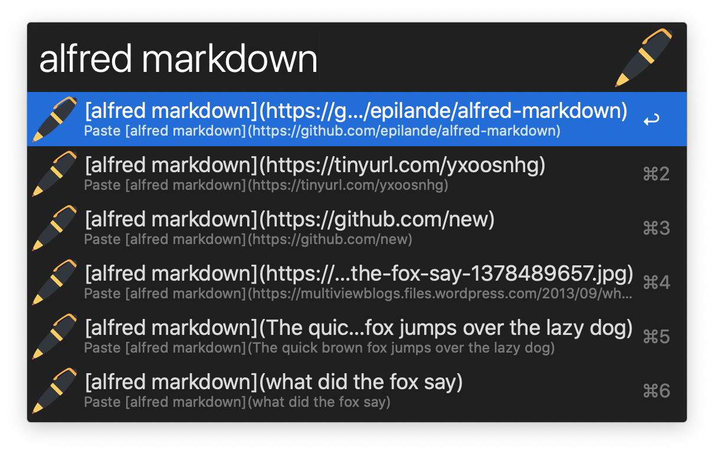

  <h1>Alfred Markdown 🖊</h1>

  <strong>Markdown text expander</strong> 
   
  

## Installation

1. Download the Alfred Workflow ([Markdown.alfredworkflow](https://github.com/epilande/alfred-markdown/releases/latest/download/Markdown.alfredworkflow)).
1. Double-click to import into Alfred (requires Powerpack).
1. Customize workflow and set hotkeys.

## Usage

- `url {text}` - Set link for selected text.
- `img {text}` - Set image link for selected text.
- `i {text}` - Set selected text to italics.
- `b {text}` - Set selected text to bold.
- `{ {text}` - Wrap selected text with `{ }`.
- `[ {text}` - Wrap selected text with `[ ]`.
- `( {text}` - Wrap selected text with `( )`.
- `` ` {text}`` - Wrap selected text with `` ` ` ``.
- `check {text}` - Prepends `- [x]` before selected text.

## Demo

## More workflows

- 🔍 [alfred-browser-tabs](https://github.com/epilande/alfred-browser-tabs) - Search browser tabs from Chrome, Brave, & Safari.
- 🤫 [alfred-be-quiet](https://github.com/epilande/alfred-be-quiet) - Workflow to automatically pause audio/video playing.
- 🔐 [alfred-wifi-password](https://github.com/epilande/alfred-wifi-password) - Get Wi-Fi password from Keychain.
- 🗝 [alfred-password-generator](https://github.com/epilande/alfred-password-generator) - Workflow to generate passwords.
- 🎨 [alfred-prettier-clipboard](https://github.com/epilande/alfred-prettier-clipboard) - Format code in your clipboard with Prettier.

## License

[MIT License](https://oss.ninja/mit/epilande/)
